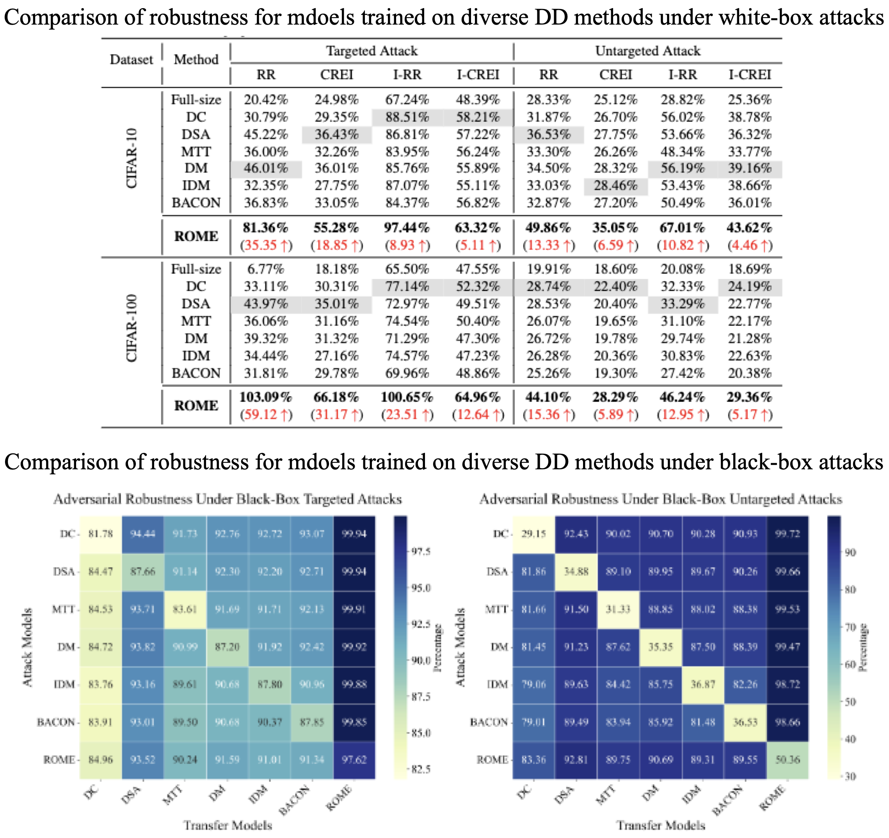

<p align="center">

</p>

### [Project Page](https://github.com/) | [Paper](https://arxiv.org/) | [Distilled Dataset](https://share.multcloud.link/share/b925cdfa-6a21-4168-b7d6-33a88a416bc0) | [Model](https://share.multcloud.link/share/b925cdfa-6a21-4168-b7d6-33a88a416bc0)

This repository contains the code and implementation details for the research paper titled "**ROME is Forged in Adversity: Robust Distilled Datasets via Information Bottleneck**". 

## 🎯 Overview of ROME

<p align="center">
  
  <figcaption><strong>Figure 1:</strong> Comparison of previous Dataset Distillation (DD) methods and ROME under adversarial attacks.  
  (a) Traditional DD methods align gradients and distributions between original and synthetic datasets but remain vulnerable to adversarial attacks, leading to low test accuracy.  
  (b) ROME leverages the Information Bottleneck (IB) principle to enhance adversarial robustness, maintaining high test accuracy even under perturbations.</figcaption>
</p>


> **Abstract:** Dataset Distillation (DD) compresses large datasets into smaller, synthetic subsets, achieving performance similar to full datasets. However, models trained on distilled datasets remain vulnerable to adversarial attacks, limiting their use in safety-critical areas. While adversarial robustness has been widely studied in other fields, research on improving DD robustness is still limited. To address this, we propose <u>**ROME**</u>, a method that enhances the adversarial <u>**RO**</u>bustness of DD by leveraging the Infor<u>**M**</u>ation Bottlen<u>**E**</u>ck (IB) principle. ROME includes two components: a *performance-aligned term* for accuracy and a *robustness-aligned term* to improve resilience by aligning feature distributions between synthetic and perturbed images. We also introduce the Improved Robustness Ratio (I-RR) as a better metric for DD robustness. Extensive experiments on CIFAR-10 and CIFAR-100 datasets show that ROME outperforms existing DD methods in adversarial robustness, achieving up to a 40% improvement in I-RR under white-box attacks and up to 35% under black-box attacks on CIFAR-10.
>
### 🔥 Key Features and Contributions
<p align="center">
  
  <figcaption><strong>Figure 2:</strong> The ROME framework: ROME utilizes Information Bottleneck (IB) to frame the robust dataset distillation problem as a min-max optimization of mutual information. It consists of two key components: (a) The performance-aligned term aims to maximize the separation between latent space information and the neural network's output by aligning the distribution of logits with true labels. (b) The robustness-aligned term minimizes the discrepancy between latent space information and the network's input, using a robust prior, which is a perturbed version of the source dataset under adversarial attacks. By aligning the embedding layers, ROME generates a robust distilled dataset that performs well against adversarial attacks.</figcaption>
</p>

- **Theoretical Framework**: Introduces the Information Bottleneck (IB) principle into dataset distillation, leveraging the Conditional Entropy Bottleneck (CEB) to incorporate adversarial robustness as a prior.

- **Algorithm Design**: Proposes performance-aligned and robustness-aligned terms to balance model accuracy and adversarial robustness, enhanced by robust priors from pretrained models.

- **Evaluation and Validations**: Introduces I-RR and achieves up to 40% and 35% robustness gains under white-box and black-box attacks on CIFAR datasets.

### 📈 Experimental Results
We evaluate and compare the adversarial robustness of ROME and other dataset distillation (DD) methods against both white-box and black-box attacks, under both targeted and untargeted settings:
<p align="center">
  
</p>

## 🛠 Getting Started
Follow these steps to set up the environment and run the code.

### Step 1: Clone the Repository
- Run the following command to download the repository:
  ```
  git clone https://github.com/zhouzhengqd/ROME.git
  ```
### Step 2: Download Datasets
- Download the CIFAR-10/100 datasets from the official source, or use the [shared download link](https://share.multcloud.link/share/bbe57236-3ca2-42b2-aa10-88394c2c4b04) provided by [BEARD](https://github.com/zhouzhengqd/BEARD) for quicker access. Place them in the relevant directory.
### Step 3: Set Up the Conda Environment
- Run the following commands to create and activate the conda environment:
    ```
    cd ROME
    cd Code
    conda env create -f environment.yml
    conda activate rome
    ```
## 📁 Directory Structure
- `ROME`
    - `Code`
        - `data`
          - `datasets`
        - `checkpoints`
        - `result`
        - Files for ROME
        - `command.txt`
        - `enviroment.yml`
        - ...
        - ...
        - ...
## Command for Reproducing Experiment Results and Evaluation
### Training the Distilled Datasets 
Follow the training command in the `command.txt`. For example, to train ROME on CIFAR-10 with IPC-50, run the following command:
  ```
    python3 -u ROME_cifar10.py --dataset CIFAR10 --model ConvNet --ipc 50 --dsa_strategy color_crop_cutout_flip_scale_rotate --init real --lr_img 0.2 --num_exp 5 --num_eval 5 --net_train_real --eval_interval 500 --outer_loop 1 --mismatch_lambda 0 --net_decay --embed_last 1000 --syn_ce --ce_weight 0.1 --train_net_num 1 --aug
  ```
### Evaluating the Distilled Datasets 
Follow the BEARD benchmark configuration:
- Step 1: Download the [BEARD](https://github.com/zhouzhengqd/BEARD) repository.
- Step 2: Download the [Distilled Dataset](https://share.multcloud.link/share/b925cdfa-6a21-4168-b7d6-33a88a416bc0) and [Model](https://share.multcloud.link/share/b925cdfa-6a21-4168-b7d6-33a88a416bc0), and follow the BEARD instructions for quick evaluation.
- Step 3: Replace the distilled datasets with your own finished training results.

## 🙏 Acknowledgments

We would like to thank the contributors of the following projects that inspired and supported this work: [DC, DSA, DM](https://github.com/VICO-UoE/DatasetCondensation), [MTT](https://github.com/GeorgeCazenavette/mtt-distillation), [IDM](https://github.com/uitrbn/IDM), [BACON](https://github.com/zhouzhengqd/BACON), and [BEARD](https://github.com/zhouzhengqd/BEARD).