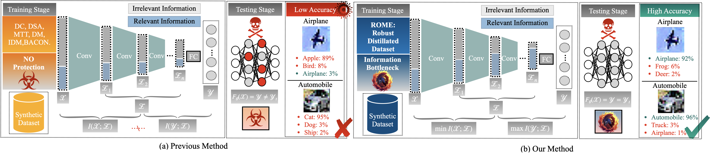

<p align="center">

</p>

### [Project Page](https://github.com/) | [Paper](https://arxiv.org/) | [Distilled Dataset](https://share.multcloud.link/share/b925cdfa-6a21-4168-b7d6-33a88a416bc0) | [Model](https://share.multcloud.link/share/b925cdfa-6a21-4168-b7d6-33a88a416bc0)

This repository contains the code and implementation details for the research paper titled "**ROME is Forged in Adversity: Robust Distilled Datasets via Information Bottleneck**". 

## 🎯 Overview of ROME

<p align="center">
  
  <figcaption><strong>Figure 1:</strong> 
  Comparison of previous DD methods and ROME under adversarial attacks: (a) Previous DD methods align representations between original and synthetic datasets but remain vulnerable to adversarial attacks due to their neglect of the mutual information among input, latent representations, and output, leading to reduced accuracy under perturbations. 
  (b) Our proposed method, ROME, employs the information bottleneck principle to minimize mutual information between input and latent representations, while maximizing it between output and latent representations, thereby enhancing adversarial robustness and preserving high accuracy under perturbations.</figcaption>
</p>


> **Abstract:**  Dataset Distillation (DD) compresses large datasets into smaller, synthetic subsets, enabling models trained on them to achieve performance comparable to those trained on the full data. However, these models remain vulnerable to adversarial attacks, limiting their use in safety-critical applications. While adversarial robustness has been widely studied in other fields, research on improving DD robustness is still limited.  To address this, we propose <u>**ROME**</u>, a method that enhances the adversarial <u>**RO**</u>bustness of DD by leveraging the Infor<u>**M**</u>ation Bottlen<u>**E**</u>ck (IB) principle. ROME includes two components: a performance-aligned term for accuracy and a robustness-aligned term to improve resilience by aligning feature distributions between synthetic and perturbed images. We also introduce the Improved Robustness Ratio (I-RR) as a better metric for DD robustness. Extensive experiments on CIFAR-10 and CIFAR-100 datasets show that ROME outperforms existing DD methods in adversarial robustness, achieving up to a 40% improvement in I-RR under white-box attacks and up to 35% under black-box attacks on CIFAR-10.
>
### 🔥 Key Features and Contributions
<p align="center">
  
  <figcaption><strong>Figure 2:</strong> The framework of ROME: ROME utilizes the information bottleneck to frame the robust dataset distillation problem as a min-max optimization of mutual information. It consists of two key components: (a) The performance-aligned term maximizes the mutual information between the latent representations and the output by aligning the logits with the true labels. (b) The robustness-aligned term minimizes the mutual information between latent representations and the input, conditioned on a robust prior (the adversarially perturbed dataset), by aligning the embeddings to reduce the discrepancy.</figcaption>
</p>

- **Theoretical Framework**: Introduces the Information Bottleneck (IB) principle into dataset distillation, leveraging the Conditional Entropy Bottleneck (CEB) to incorporate adversarial robustness as a prior.

- **Algorithm Design**: Proposes performance-aligned and robustness-aligned terms to balance model accuracy and adversarial robustness, enhanced by robust priors from pretrained models.

- **Evaluation and Validations**: Introduces I-RR and achieves up to 40% and 35% robustness gains under white-box and black-box attacks on CIFAR datasets.

### 📈 Experimental Results
We evaluate and compare the adversarial robustness of ROME and other DD methods against both white-box and black-box attacks, under both targeted and untargeted settings:


<p align="center">
  
  <figcaption>
    <strong>Table 1:</strong> Comparison of model robustness when trained using various DD methods with IPC settings of {1, 10, 50}, against both white-box targeted and untargeted attacks on the CIFAR-10 and CIFAR-100 datasets. RR represents the robustness ratio, and I-RR denotes the improved robustness ratio. The best results between the baseline and proposed methods are highlighted in <strong>bold</strong>, while the second-best results are <u>underlined</u>. Improvements in metrics compared to the second-best results are highlighted in <span style="color:red">red</span>.
  </figcaption>
</p>

<p align="center">
  <figcaption><strong>Figure 3:</strong> Robustness heatmap of models trained on distilled CIFAR-10 datasets with IPC-50 settings under targeted and untargeted attacks. The vertical axis represents the attacked models, while the horizontal axis shows the models undergoing transfer attacks. The values in the heatmap denote the I-RR, with <strong>darker colors</strong> indicating <strong>higher I-RR values</strong>, which reflect <strong>better robustness</strong> against adversarial attacks.</figcaption>
</p>

## 🛠 Getting Started
Follow these steps to set up the environment and run the code.

### Step 1: Clone the Repository
- Run the following command to download the repository:
  ```
  git clone https://github.com/zhouzhengqd/ROME.git
  ```
### Step 2: Download Datasets
- Download the CIFAR-10/100 datasets from the official source, or use the [shared download link](https://share.multcloud.link/share/bbe57236-3ca2-42b2-aa10-88394c2c4b04) provided by [BEARD](https://github.com/zhouzhengqd/BEARD) for quicker access. Place them in the relevant directory.
### Step 3: Set Up the Conda Environment
- Run the following commands to create and activate the conda environment:
    ```
    cd ROME
    cd Code
    conda env create -f environment.yml
    conda activate rome
    ```
## 📁 Directory Structure
- `ROME`
    - `Code`
        - `data`
          - `datasets`
        - `checkpoints`
        - `result`
        - Files for ROME
        - `command.txt`
        - `enviroment.yml`
        - ...
        - ...
        - ...
## 🌟 Command for Reproducing Experiment Results and Evaluation
### Training the Distilled Datasets 
Follow the training command in the `command.txt`. For example, to train ROME on CIFAR-10 with IPC-50, run the following command:
  ```
    python3 -u ROME_cifar10.py --dataset CIFAR10 --model ConvNet --ipc 50 --dsa_strategy color_crop_cutout_flip_scale_rotate --init real --lr_img 0.2 --num_exp 5 --num_eval 5 --net_train_real --eval_interval 500 --outer_loop 1 --mismatch_lambda 0 --net_decay --embed_last 1000 --syn_ce --ce_weight 0.1 --train_net_num 1 --aug
  ```
### Evaluating the Distilled Datasets 
Follow the BEARD benchmark configuration:
- Step 1: Download the [BEARD](https://github.com/zhouzhengqd/BEARD) repository.
- Step 2: Download the [Distilled Dataset](https://share.multcloud.link/share/b925cdfa-6a21-4168-b7d6-33a88a416bc0) and [Model](https://share.multcloud.link/share/b925cdfa-6a21-4168-b7d6-33a88a416bc0), and follow the BEARD instructions for quick evaluation.
- Step 3: Replace the distilled datasets with your own finished training results.

## 🙏 Acknowledgments

We would like to thank the contributors of the following projects that inspired and supported this work: [DC, DSA, DM](https://github.com/VICO-UoE/DatasetCondensation), [MTT](https://github.com/GeorgeCazenavette/mtt-distillation), [IDM](https://github.com/uitrbn/IDM), [BACON](https://github.com/zhouzhengqd/BACON), and [BEARD](https://github.com/zhouzhengqd/BEARD).

<!-- ## Citation
```
@article{zhou2024rome,
  title={ROME is Forged in Adversity: Robust Distilled Datasets via Information Bottleneck},
  author={},
  journal={},
  year={2024}
}
```
## Star History

[](https://star-history.com/#zhouzhengqd/ROME.git&Date) -->